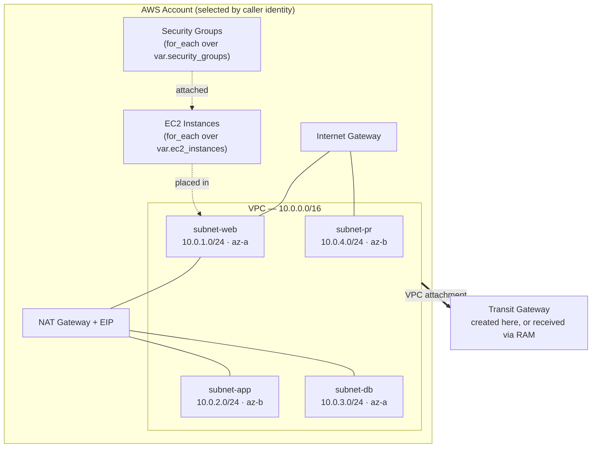

# AWS Multi-Account Network Baseline

Terraform for a reusable, **account-aware** AWS network foundation: VPC with named subnets, Internet/NAT egress, security groups, EC2, and Transit Gateway — including the **owner / receiver split** needed when a TGW is shared across accounts via AWS RAM.

The root module reads the AWS account it is currently authenticated against and selects that account's network definition from `terraform.tfvars`. The same code deploys to every account in the organisation; only the variables change.

---

## Why this exists

In a multi-account AWS organisation, each account needs the same shape of network — a VPC, public/private subnets, an IGW for ingress, a NAT for egress, and an attachment to a shared Transit Gateway — but with different CIDRs, and with one account *owning* the TGW while the rest *receive* it.

The usual answers are to copy a directory per account (drifts immediately) or to hand-maintain a workspace per account (drifts more slowly). This module takes a third route: **one root module, one variable map keyed by account ID**, and a data lookup that picks the right entry at plan time.

```hcl
locals {
  current_account_id = data.aws_caller_identity.current.account_id
  selected_account   = try(var.accounts[local.current_account_id], null)
}
```

If the authenticated account has no entry in `var.accounts`, a `null_resource` guard fails the plan with an explicit message rather than silently building the wrong network.

---

## Architecture



Every subnet gets its own route table. Subnets named in `igw_subnets` receive a `0.0.0.0/0` route to the Internet Gateway; subnets named in `nat_subnets` receive a `0.0.0.0/0` route to the NAT Gateway. The NAT itself is placed in the first IGW subnet, because a NAT with no route to the internet is just an expensive ENI.

---

## Repository layout

| Path | Purpose |
| :--- | :--- |
| `main.tf` | Root module — wires the four submodules together and resolves cross-module references |
| `locals.tf` | Account selection, and `"auto"` → real VPC ID resolution for TGW attachments |
| `data.tf` | `aws_caller_identity` lookup |
| `variables.tf` | Typed input contracts (nested `object` types with `optional()` defaults) |
| `terraform.tfvars` | **Example** configuration — replace with your own |
| `outputs.tf` | VPC, subnet, SG, TGW and EC2 identifiers for downstream stacks |
| `Modules/VPC/` | VPC, subnets, IGW, NAT, route tables and associations |
| `Modules/SG/` | Security groups built from declarative ingress/egress rule lists |
| `Modules/EC2/` | Instances with root + additional encrypted EBS volumes |
| `Modules/TGW/` | Transit Gateway, route tables, VPC attachments and static routes |

---

## Design decisions worth calling out

**Subnets are addressed by name, not by index.** `var.subnet_details` is a list of `{ name, cidr, az }`, immediately converted to a map keyed by name. Everything downstream — routes, TGW attachments, EC2 placement — refers to `"subnet-app"`, never `subnet[2]`. Reordering the list does not destroy and recreate resources.

**`vpc_id = "auto"` resolves to the VPC this module just created.** TGW attachments frequently need to reference a VPC that does not exist until apply time. Rather than force a two-stage apply, `locals.tgw_vpc_attachments` substitutes `module.vpc.vpc_id` wherever the literal string `"auto"` appears, while still allowing an explicit VPC ID for pre-existing VPCs.

**One module handles both TGW ownership models.** When `shared_transit_gateway_id` is empty, the module creates a TGW and its route tables. When it is set, the module skips creation and attaches to the shared TGW instead. `count` on the resources and a `local.transit_gateway_id` indirection keep this to a single code path.

**Conditional creation via `count`, not separate stacks.** `create_transit_gateway` and a non-empty `ec2_instances` map gate their respective modules, so a network-only account and a full workload account run the same root module.

**Tags are applied twice, deliberately.** `provider.default_tags` covers everything AWS supports; `merge(var.common_tags, {...})` adds per-resource `Name` and `AccountId`. The second is what makes a 40-subnet console view readable.

---

## Usage

**Requirements:** Terraform >= 1.5.0, AWS provider ~> 5.0, credentials for the target account.

```bash
git clone https://github.com/Rishi4662/Network-Module.git
cd Network-Module
```

Add your account to `terraform.tfvars`, keyed by its 12-digit account ID:

```hcl
account_name = "example"

accounts = {
  "111122223333" = {
    vpc_cidr = "10.0.0.0/16"
    subnet_details = [
      { name = "subnet-web", cidr = "10.0.1.0/24", az = "ap-south-1a" },
      { name = "subnet-app", cidr = "10.0.2.0/24", az = "ap-south-1b" },
      { name = "subnet-db",  cidr = "10.0.3.0/24", az = "ap-south-1a" },
      { name = "subnet-pr",  cidr = "10.0.4.0/24", az = "ap-south-1b" }
    ]
    igw_subnets = ["subnet-web", "subnet-pr"]
    nat_subnets = ["subnet-app", "subnet-db"]
  }
}
```

Then:

```bash
terraform init
terraform plan
terraform apply
```

The default region is `ap-south-1`, set in `providers.tf`.

### Receiving a shared Transit Gateway

In the account that owns the TGW, leave `is_receiving_account = false` and set `create_transit_gateway = true`. Share the resulting TGW through AWS RAM, then in each receiving account:

```hcl
create_transit_gateway = false
is_receiving_account   = true

receiving_account_tgw = {
  name                      = "shared-tgw"
  shared_transit_gateway_id = "tgw-0abc123def456789"
  vpc_attachments = [{
    name         = "spoke-attachment"
    vpc_id       = "auto"
    subnet_names = ["subnet-app", "subnet-db"]
  }]
}
```

---

## Inputs

| Name | Type | Default | Description |
| :--- | :--- | :--- | :--- |
| `accounts` | `map(object)` | — | VPC + subnet configuration keyed by AWS account ID |
| `account_name` | `string` | — | Used in resource naming (`vpc-<account_name>`) |
| `common_tags` | `map(string)` | `{}` | Applied to every resource via provider default tags and per-resource merge |
| `security_groups` | `map(object)` | `{}` | Declarative ingress/egress rule sets, one SG per key |
| `ec2_instances` | `map(object)` | `{}` | Instances with root volume, extra EBS volumes and per-instance tags |
| `create_transit_gateway` | `bool` | `false` | Create and own a Transit Gateway in this account |
| `transit_gateway` | `object` | `{ name = "" }` | TGW route tables, VPC attachments and static routes |
| `is_receiving_account` | `bool` | `false` | Attach to a RAM-shared TGW instead of creating one |
| `receiving_account_tgw` | `object` | — | Shared TGW ID and the attachments to create against it |

## Outputs

| Name | Description |
| :--- | :--- |
| `vpc_id` | VPC ID |
| `subnet_ids` | Map of subnet name → subnet ID |
| `security_group_ids` | Map of SG name → security group ID |
| `transit_gateway_id` | TGW ID, or `null` when none was created |
| `tgw_vpc_attachment_ids` | Map of attachment name → attachment ID |
| `ec2_instance_ids` | Map of instance name → instance ID |
| `ec2_instance_private_ips` / `ec2_instance_public_ips` | Instance addressing |
| `ec2_instance_details` | Full per-instance detail map |

---

## Known limitations

Worth stating plainly rather than leaving for a reviewer to find:

- **The example `terraform.tfvars` is deliberately permissive and is not a secure baseline.** `web-sg` opens ports 22, 80 and 443 to `0.0.0.0/0`. Open SSH from the internet is fine for a throwaway demo and wrong for anything else — restrict port 22 to a bastion SG or your corporate range, or drop it entirely in favour of SSM Session Manager, before using this anywhere real.
- **One NAT Gateway per VPC, in a single AZ.** Cheap, but not AZ-fault-tolerant. Production workloads should place a NAT per availability zone.
- **No remote state backend is configured.** State is local. Add an S3 + DynamoDB backend before any shared or CI-driven use.
- **The example AMI ID is a placeholder** and is region-specific. Replace it, or switch to an `aws_ami` data source lookup.
- **`account_name` is a single string** while `accounts` is a map, so one apply targets one account. Multi-account fan-out is driven by CI running this module per account, not by a single apply.

## Possible next steps

S3/DynamoDB remote state · NAT per AZ · VPC flow logs to CloudWatch · `aws_ami` data source instead of hardcoded IDs · `terraform-docs` in CI to keep the tables above honest · Checkov or tfsec in a pre-commit hook
